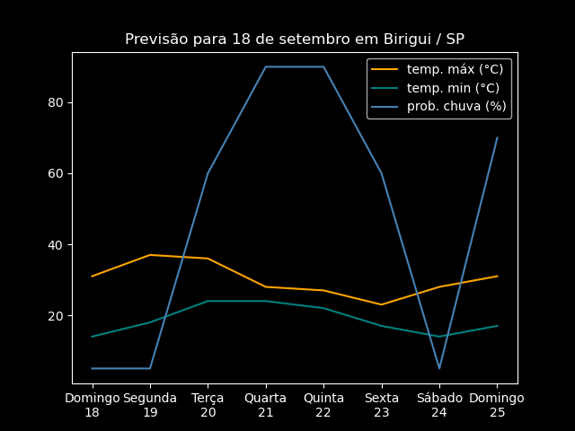
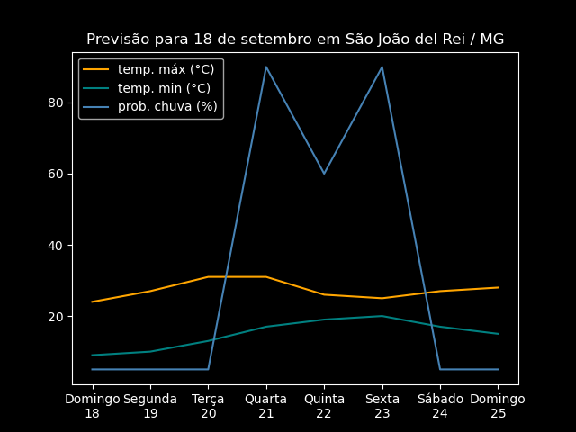
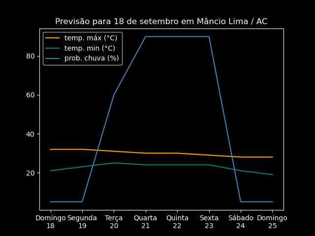
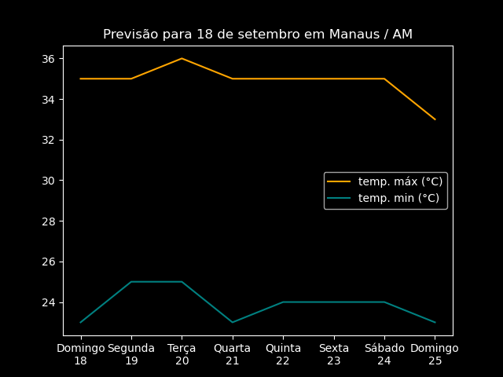
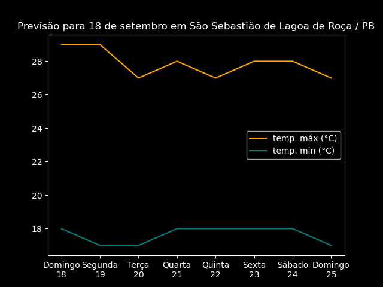

# clima: chuva e temperatura

Demo usando matplotlib para gerar gráficos com dados de temperatura e probabilidade
de chuva lidos em um arquivo HTML.

Os dados são do [Centro de Previsão de Tempo e Estudos Climáticos](https://tempo.cptec.inpe.br/) do [Instituto de Pesquisas Espaciais](https://www.gov.br/inpe/pt-br) (INPE).

O programa realiza o mínimo de requisições possível, trabalhando primeiro com os dados já salvos no sistema local e pedindo confirmação para cada requisição externa.

Modifique o arquivo `start.py` se desejar adicionar ou remover cidades.

Para executar na sua máquina você pode usar o [Poetry](https://python-poetry.org/).

Uma vez instalado o Poetry, você pode usar:
```bash
git clone https://github.com/jultty/dataviz/
cd dataviz/clima/cptec
poetry install
poetry run python start.py
```

Você também pode instalar as dependências listadas no arquivo `pyproject.toml` manualmente, se preferir, e executar com `python start.py`.

## Imagens
### Com dados de chuva



### Apenas dados de temperatura



## Dados CSV
```csv
Dia,Data,Máx,Min,Chuva
Domingo,18/09/2022,31.0,14.0,5.0
Segunda,19/09/2022,37.0,18.0,5.0
Terça,20/09/2022,36.0,24.0,60.0
Quarta,21/09/2022,28.0,24.0,90.0
Quinta,22/09/2022,27.0,22.0,90.0
Sexta,23/09/2022,23.0,17.0,60.0
Sábado,24/09/2022,28.0,14.0,5.0
Domingo,25/09/2022,31.0,17.0,70.0
```

## Classes
* Cidade
    * Armazena todas as informações para cada cidade, como o nome, UF, dados para plotagem e caminhos de saída dos arquivos.
* Aranha
    * Recebe uma lista de cidades, verifica se já existem dados baixados para cada uma e obtém os dados da rede em caso negativo. Requer confirmação antes de cada requisição externa.
* Tratadora
    * Recebe uma lista de cidades e trata os dados, retirando palavras desnecessárias e ordenando os valores para que fiquem apenas os dados prontos para plotagem.
* Plotadora
  * Recebe uma lista de cidades, salva os gráficos em arquivos PNG no sistema local e exibe-os usando a interface gráfica do matplotlib.
